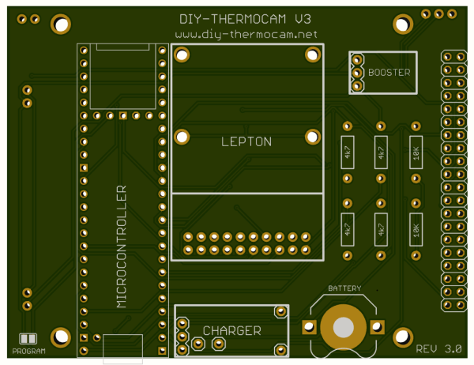
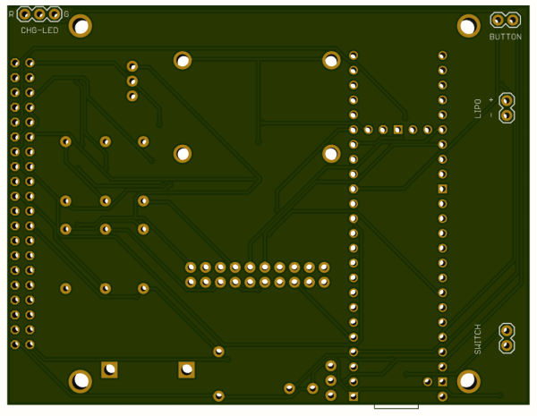

# PCB

## General

The printed circuit board has been created with Autosoft Eagle: http://www.autodesk.com/education/free-software/eagle.
Use this software to open the .sch (Schematic) or .brd (Board) files.

You can also use the Gerber.zip and upload it to any PCB service of your choice to manufacture the board, for example http://www.smart-prototyping.com/PCB-Prototyping.html. Dimensions are 89.4mm (w) x 68.4mm (h), 1.6mm thickness and 2 layers.

## Front

## Back

