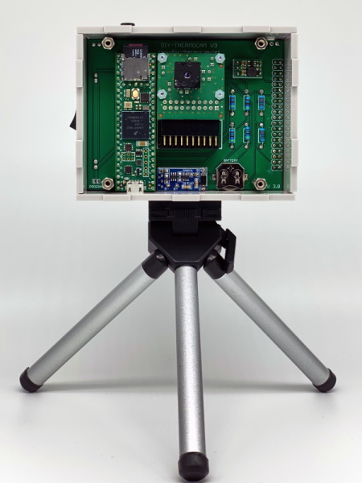

**The DIY-Thermocam V3 is an open-source thermal imager based on the FLIR Lepton3.5 sensor:**

### **[Check out the official website for more information about the project](https://www.diy-thermocam.net/)**

This repository contains the **[latest firmware releases](https://github.com/maxritter/DIY-Thermocam/releases)** for the device, as well as related **[Datasheets](https://github.com/maxritter/DIY-Thermocam/tree/master/Datasheets)** and **[Documents](https://github.com/maxritter/DIY-Thermocam/tree/master/Documents)**, the **[Enclosure](https://github.com/maxritter/DIY-Thermocam/tree/master/Enclosure)**, the **[PCB](https://github.com/maxritter/DIY-Thermocam/tree/master/PCB)** and various **[Desktop Software](https://github.com/maxritter/DIY-Thermocam/tree/master/Software)** to **extend the functionalities of the Thermocam beyond the on-device capabilities**. The **whole firmware is open-source** and can be **modified by anybody** using the **source code** provided **[here](https://github.com/maxritter/DIY-Thermocam/tree/master/Firmware_V3)**. All other information can be found on the website linked above.

